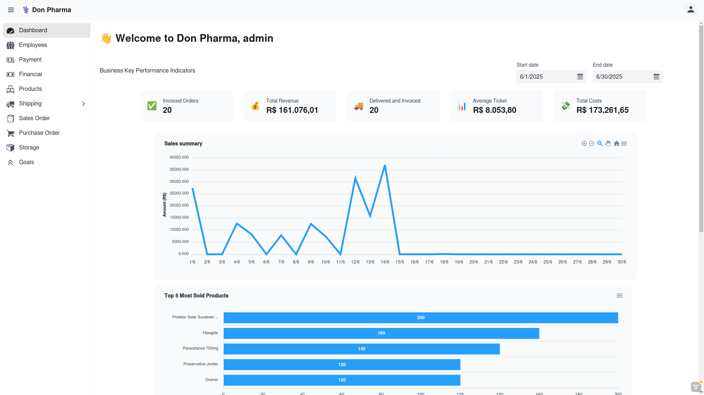

# DonPharma

DonPharma é um sistema de gestão para farmácias, desenvolvido em Java com Vaadin, que oferece funcionalidades para controle de vendas, estoque, funcionários, pedidos, metas e relatórios financeiros. O projeto utiliza uma arquitetura MVC, integra banco de dados PostgreSQL e oferece uma interface web responsiva e personalizável.




## Tecnologias Utilizadas

- **Java 23** — Backend principal
- **Vaadin 24** — Framework web para UI moderna em Java
- **Hibernate** — ORM para persistência de dados
- **PostgreSQL** — Banco de dados relacional
- **Jetty** — Servidor de aplicação para desenvolvimento
- **Lombok** — Redução de boilerplate em Java
- **Spring Security Crypto** — Utilitários de criptografia
- **ApexCharts** — Gráficos interativos na interface
- **Docker** — Gerenciamento de ambiente de banco de dados

## Como Executar o Projeto

### 1. Subir o Banco de Dados PostgreSQL
Certifique-se de ter o Docker instalado. Execute:

```sh
docker-compose up -d
```

Isso irá iniciar um container PostgreSQL acessível em localhost:5432 com o banco dondb, usuário admin e senha password.

### 2. Configurar mock de dados
O projeto possui uma base de dados para auxiliar a visualização dos dados.

```sh
docker exec -it postgres_db psql -d dondb -U admin -f /docker-entrypoint-initdb.d/mock_data.sql
```

### 3. Configurar o Ambiente Java
O projeto requer Java 23. 

### 4. Rodar a Aplicação
Com o banco rodando, execute o comando Maven para iniciar o servidor Jetty:

```sh
mvn jetty:run
```

Acesse a aplicação em http://localhost:8080 com o usuário **admin** e senha **adminpass**
